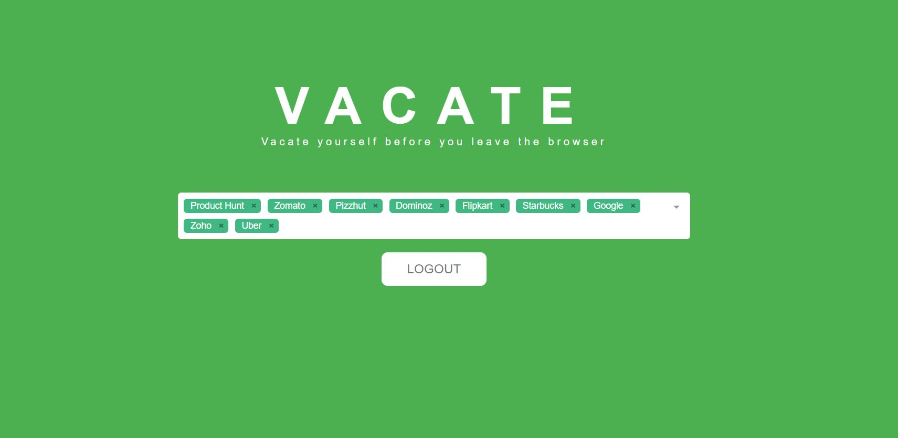

# Vacate

> Vacate yourself before you leave the browser.

Vacate can logs you out of dozens of services with single button click. Logging out of your account when you’re done using a computer other than your own is just good security and is very handy. If you use multiple accounts and want to simplify the process, Vacate can log you out of over 40 major services at once at blazing speed.

## Screenshot

## FAQ

### How this is better than superlogout?

* More websites
* Blazing fast with Vuejs
* Controlled logout
* Open Source

## License

MIT © [Bharathvaj Ganesan](https://bharathvajganesan.me)
